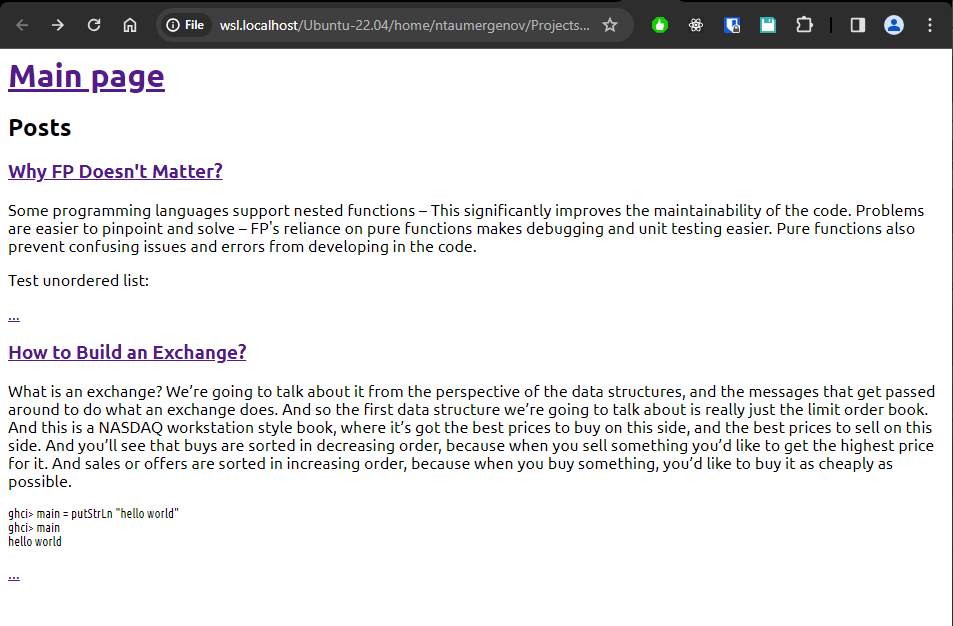
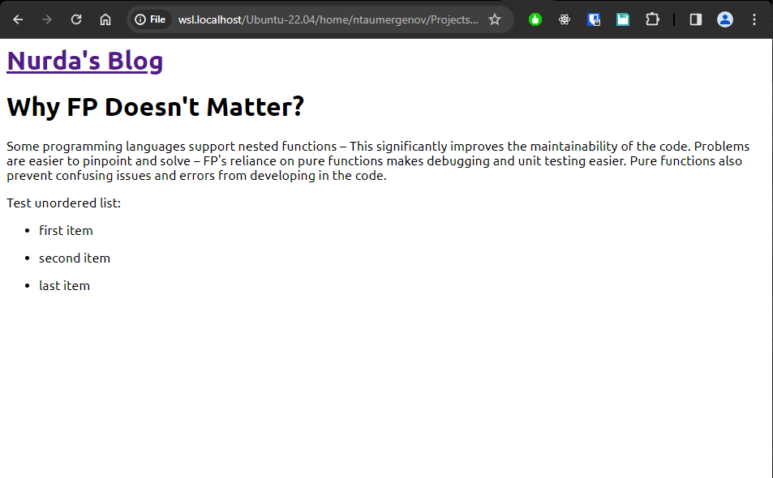

# blog-hs - static blog generator written is Haskell

## How to use?

* convert command converts input given to html string:
```
./blog-hs-gen convert
* This is a sample heading

This is a sample paragraph

code:

> main = putStrLn "hello world!"

ordered list:

# first item
# second item
# third item

unordered list:

* Bread
* Butter
* Jam
```
* convert-dir command converts a whole director of text files into blog:
```
./blog-hs-gen convert-dir -i sample/sampleDir -o sample/outputDir -N Nurda\'s\ Blog
```


Cabal commands:
* `cabal run blog-hs-gen COMMAND` - for running an executable with cabal
* `cabal test` - to run tests definted at `./test`


Screenshots:

* index.html


* post.html



Credits:
* [Read the book](https://learn-haskell.blog/)
* [Original implementation](https://github.com/soupi/haskell-study-plan)
* [lectures](https://www.seas.upenn.edu/~cis1940/spring13/lectures.html)

